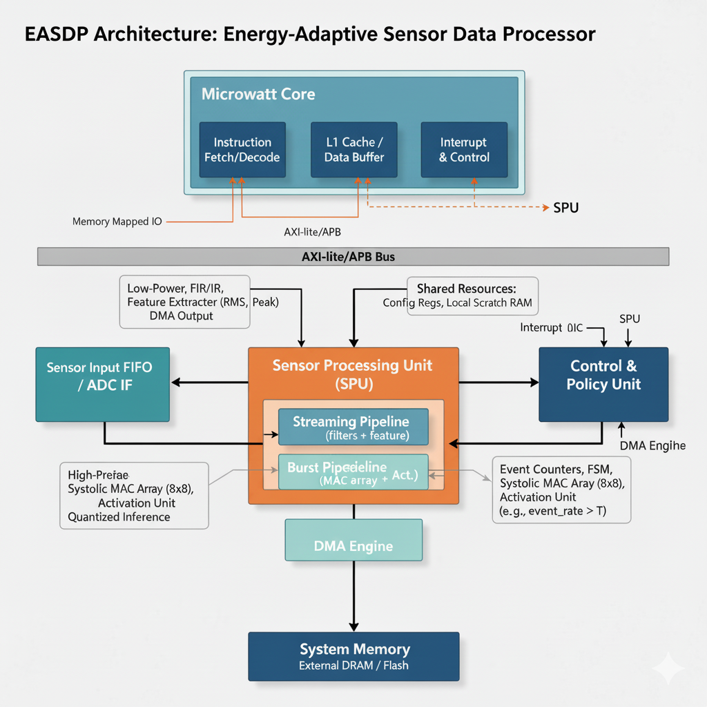

# ⚡ Energy-Adaptive Sensor Data Processing on Microwatt  
_A Reconfigurable SoC for Low-Power Edge Intelligence_  

---

## 📄 Problem Statement
The **explosion of edge computing** demands systems that can process **heterogeneous sensor data** under **tight energy & latency constraints**.  

Applications such as:  
- 🩺 **Continuous ECG monitoring** (healthcare wearables)  
- ✋ **Gesture recognition** (smartwatches, AR/VR)  
- 🌍 **Environmental sensing** (IoT nodes)  

👉 All require **continuous, low-power streaming** + **occasional compute bursts**.  

**Current trade-offs:**  
- 🛠️ Fixed-function accelerators → 🔋 energy-efficient ✅, but rigid ❌  
- 🖥️ General-purpose CPUs → flexible ✅, but inefficient ❌  

⚠️ This gap **blocks scalable, energy-adaptive edge intelligence**, especially for **medical & wearable devices** where:  
- 🕒 **24/7 continuous operation** is critical  
- 🔋 **Battery resources are precious**  

---

## 💡 Proposed Solution
We introduce the **Energy-Adaptive Sensor Data Processor (EASDP)** tightly coupled with the open-source **Microwatt RISC-V core**.  

### 🔀 Dual-Mode SPU (Sensor Processing Unit)
1. **Streaming Mode**  
   - Ultra-low-power operations: FIR/IIR filters, moving average, feature extraction (e.g., ECG R-peak).  
   - Keeps device alive continuously with minimum energy.  

2. **Burst Mode**  
   - Short, high-performance compute bursts.  
   - Compact systolic **MAC array (e.g., 8×8)** for gesture/keyword recognition.  
   - Activation units for ML inference.  

### 🕹️ Control & Policy Unit
- Implemented with counters + FSM.  
- Dynamically switches **between modes** based on:  
  - 🔋 Energy constraints  
  - 🕒 Latency deadlines  
  - 📈 Sensor activity levels  

### 🧠 Role of Microwatt CPU
- Host controller for the SPU.  
- Handles **sensor input**, decision logic, and workload scheduling.  
- Coordinates SPU, memory, and peripherals.  

---

## 🧩 📐👷🏻‍♀️ Detailed Architecture at a Glance

  

   
   
  <b>🔗⚡🖥️ Integration with Microwatt SoC</b>

---

## ⚙️ Key Features
1. **Dual-Mode SPU**  
   - 🔋 **Streaming pipeline** → FIR/IIR, moving avg, statistical features.  
   - ⚡ **Burst pipeline** → Compact MAC (8×8) for ML inference.  
   - 🔀 FSM-based mode switching (low overhead).  

2. **Dynamic Power Gating & Clock Control**  
   - ⏸️ Power-off idle blocks.  
   - ⚡ Minimized leakage + switching → practical for SKY130 tapeout.  

3. **Programmable Register Interface**  
   - 📝 Memory-mapped registers via Microwatt.  
   - Configurable filter coefficients, thresholds, MAC array dims.  

4. **Energy & Latency Monitoring**  
   - ⏱️ Hardware counters track cycles, events, buffer fill.  
   - Ensures **adaptive runtime switching**.  

5. **Lightweight On-Chip DMA**  
   - 🚀 Automated data movement between **sensor FIFO → SPU → memory**.  
   - CPU freed from repetitive tasks → saves energy.  

---

## 🌍 Impact of the Solution
### 1. 🔋 Energy Efficiency for Edge Devices  
- Combines **Microwatt CPU** + **reconfigurable accelerator**.  
- Extends **battery life** of IoT & wearables.  
- Enables **sustainable continuous operation**.  

### 2. 💸 Accessibility & Affordability  
- 100% **open-source (RISC-V, Microwatt, Yosys, OpenLane)**.  
- Low-cost & reproducible → startups, students, research labs benefit.  

### 3. 🩺 Real-World Healthcare Benefits  
- Adaptive compute for **ECG, EEG, motion tracking**.  
- Improves **accuracy & reliability** in wearables.  
- Early detection → **life-saving interventions**.  

### 4. 📡 Scalability Across Domains  
- Industrial IoT ✅  
- Smart homes ✅  
- Environmental sensing ✅  
- Autonomous edge systems ✅  

### 5. 🏭 Path to Fabrication & Commercialization  
- **Tapeout-ready** with SKY130 + OpenFrame.  
- Serves as **proof-of-concept for low-power AI accelerators**.  
- Potential entry into **$100B+ IoT semiconductor market**.  

---

## 🌟 Novelty of the Project
1. 🧩 **Microwatt + Reconfigurable Accelerator** → First integration of an open-source RISC-V core with a dual-mode SPU.  
2. 🔀 **Adaptive Dual-Mode Processing** → Seamless switch between **continuous low-power streaming** & **burst ML inference**.  
3. 🛠️ **Fabrication-Friendly, Open-Source** → SKY130 + Yosys + OpenLane + Verilator = **full open hardware flow**.  
4. 🌐 **Heterogeneous Sensor Workload Handling** → Works across ECG, IMU, environmental, and more.  
5. 🌍 **Democratized Chip Innovation** → Bridges **academia → fabrication**, empowering startups & labs.  

---

## 🎯 Why This Project Stands Out
- ✅ **First-of-its-kind open-source Microwatt SoC** for energy-adaptive processing.  
- ✅ **Tapeout-feasible** with proven simplicity (filters, MACs, FSM).  
- ✅ **Balanced**: CPU flexibility + Accelerator efficiency.  
- ✅ **Impactful**: Healthcare, IoT, industry, and beyond.  

---

## 👨‍💻 Contributors
- 📝 **Sankararayanan V**
- 📝 **Chezhiyan M**
- 📝 **Ebinesh K**

---

## 🚀 Next Steps for Hackathon
- 🏗️ RTL coding of SPU & FSM (Verilog).  
- 🧪 Simulation using **Yosys + Verilator**.  
- ⚡🖥️ Integration with Microwatt SoC  
- 📐 Physical design via **OpenLane (SKY130)**.  
- 🎉 Prepare for **tapeout submission** in OpenFrame!  

## 🧩 Architecture at a Glance
